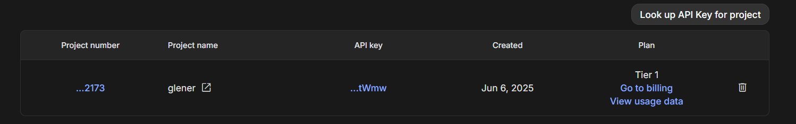

# **llm-payment-receipt-generator**

<p align="center"> 🚀 This script is designed to test nano banana model, generating fakes payment receipts</p>

<h3>🏁 Table of Contents</h3>

<br>

===================

<!--ts-->

💻 [Dependencies and Environment](#dependenciesandenvironment)

☕ [Using](#using)

👷 [Author](#author)

<!--te-->

===================

Attention! All sample receipt files are fake! ⚠️

<div id="dependenciesandenvironment"></div>

## 💻 **Dependencies and Environment**

**Gemini**: This project uses the paid Google Gemini API, it's necessary to [configure a valid Gemini API Key](https://aistudio.google.com/apikey) and link a billing account to it. Ensure you have a `.env` file with the environment variable **API_KEY**.



<div id="using"></div>

## ☕ **Using**

First, check the [dependencies](#dependenciesandenvironment) process

You can clean the environment using

```
$ make clean
```

To pass dynamic values ​​to fields, check the required and optional parameters in the [`src/args.py`](src/args.py) file.

To execute you can run the script using

```
$ python main.py
```

<div id="author"></div>

#### **👷 Author**

Made by Glener Pizzolato! 🙋

[](https://www.linkedin.com/in/glener-pizzolato-6319821b0/)
[](mailto:glenerpizzolato@gmail.com)
